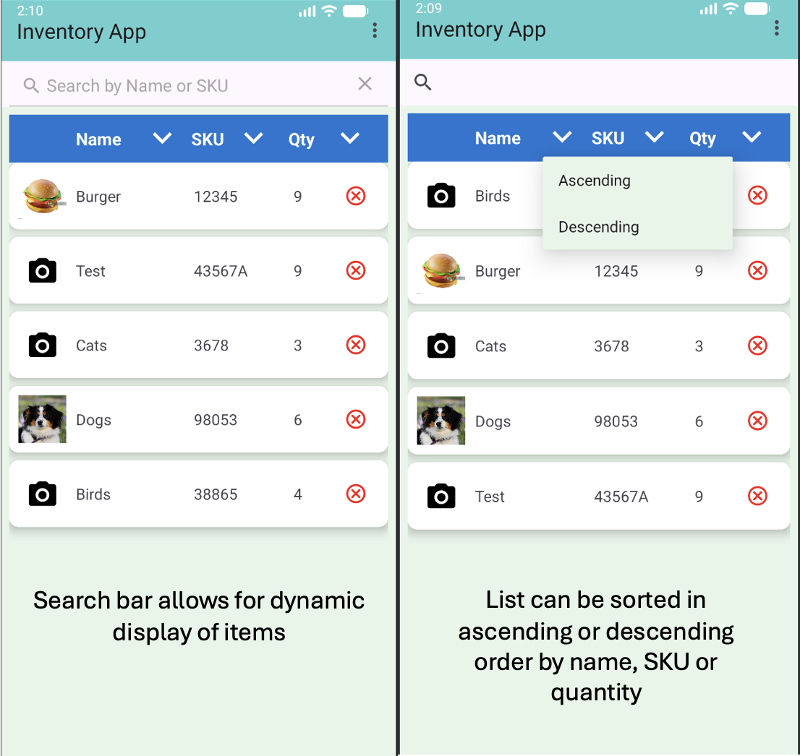
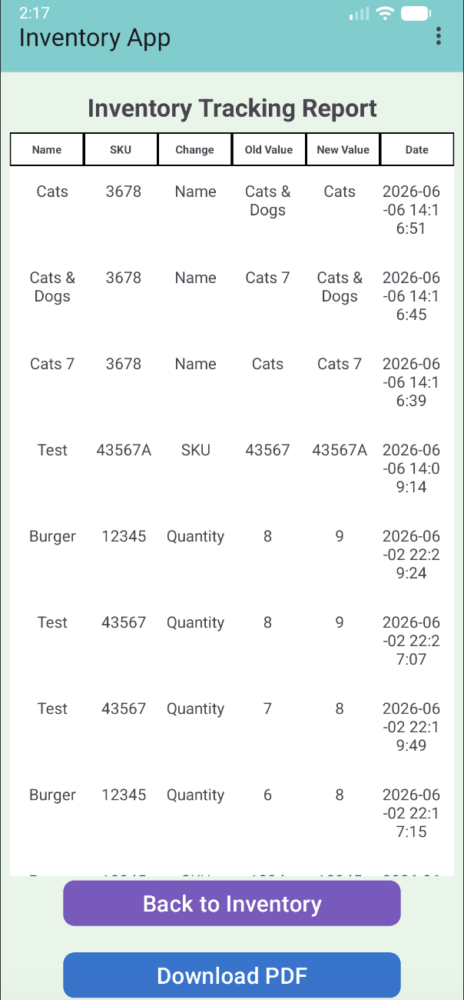
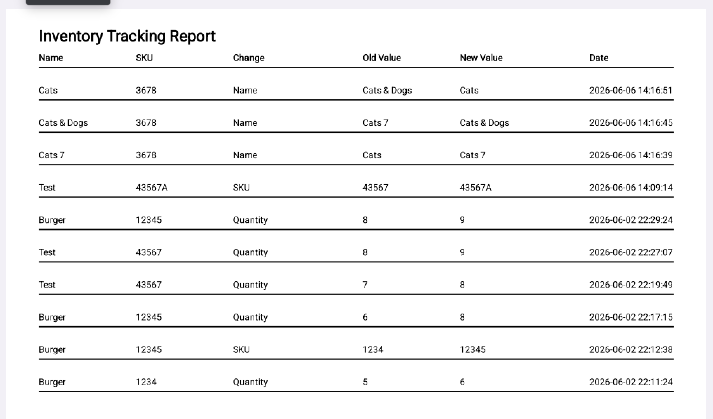
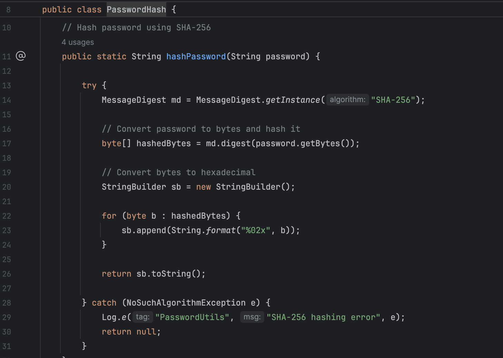

<h1 align="center">CS499 - SNHU Capstone Project</h1>
 
<h3>Professional Self-Assessment</h3>

Completing the Computer Science program at Southern New Hampshire University has been a transformative experience that strengthened my technical foundations, expanded my problem-solving abilities, and helped clarify my professional goals in the software engineering field. Through these experiences, I developed a stronger interest in SQL database design and UX/UI-focused development, which have become my primary career aspirations. I am particularly interested in working with database systems to design efficient, structured data solutions, as well as creating user-friendly interfaces that are both accessible and intuitive while supporting a positive user experience. Throughout the program, I developed a well-rounded set of skills in software design, algorithms, database systems, and secure programming practices, while also gaining practical experience applying these concepts through multiple hands-on projects. Developing my ePortfolio allowed me to reflect on my growth and demonstrate my ability to design, implement, and improve functional software systems. 

Each course in this degree program contributed unique technical and professional skills that supported the development of my capstone project, which involved enhancing the Inventory Application I originally created during my CS 360 Mobile Architectures course. Together, these experiences strengthened my abilities in collaboration, communication, algorithmic thinking, software engineering, database management, and secure system design. 

One of the earliest areas of development in my coursework was collaborating in a team environment, which I experienced in CS 250 during the SNHU Travel website project. In this role, I worked within an Agile Scrum team where collaboration was essential to completing project goals. Working alongside developers and testers helped me understand how shared responsibility and consistent teamwork contribute to successful software delivery. 

Closely tied to collaboration was communicating with stakeholders, which was also a key part of CS 250. As Scrum Master, I helped facilitate communication between the Product Owner, stakeholders, and the development team. I supported the process of gathering user stories, prioritizing requirements, and adapting to changing project needs. This experience strengthened my understanding of how clear communication ensures that software products align with user expectations.

My development of data structures and algorithms is reflected in multiple courses, including CS 320 Software Testing, Automation, and Quality Assurance, CS 330 Computational Graphics and Visualization, and CS 350 Emerging Systems and Architectures. In CS 320, I worked with object-oriented programming concepts and learned how structured class design and validation improve data integrity. I also created JUnit tests to effectively evaluate both expected and unexpected inputs, helping ensure that classes functioned correctly under a variety of conditions. In CS 350, I built a thermostat application that relied on state management and event-driven logic. The project required implementing a state machine to manage heating, cooling, and off modes while processing sensor data and user inputs in real time. In CS 330, I worked with spatial calculations in a 3D environment to create a scene that included a number of different objects within a given space, which required structured thinking about object placement and transformations. These experiences helped me build a foundation in organizing and processing data effectively.

My experience with software engineering and database systems is most clearly represented in my capstone Inventory Management Application, as well as the CS 465 Full Stack Development course. In CS 465, I learned how full-stack applications connect front-end interfaces with back-end systems and databases through APIs and routing. The web application created during this course allowed me to gain hands-on experience working with the MEAN stack and better understand how client-side and server-side technologies work together to support application functionality. In CS 360, I applied these concepts by building an Android application using Java and XML, with a SQLite database for persistent storage. The application included user authentication, inventory management functionality, and SMS notifications, demonstrating both software engineering design and database integration. 

Finally, security is represented through my Security Policy project designed for my CS 405 Secure Coding course, which I later applied directly to my CS 360 capstone application. For this assignment, I developed a defense-in-depth security strategy that included secure coding standards, encryption practices, and authentication and authorization using Triple-A principles. I also evaluated system risks using a threat matrix to identify vulnerabilities such as input validation and memory management issues. These concepts were directly applied in my Inventory Application through features such as password hashing and improved input validation, ensuring that security is integrated into the system design. 

Looking at everything together, I can clearly see how much I’ve grown throughout the program. I started with basic programming concepts and gradually moved into building full applications that include databases, security, user interfaces, and system design. One of the biggest changes in my overall approach to software development is that I now think more about structure and long-term maintainability instead of just whether something works. Each course has added something that I was able to carry forward into later projects, which helped me build more complete and intentional applications over time. 

 The artifact enhancements in this ePortfolio represent the progression of my skills throughout the Computer Science program and show how different areas of knowledge connect in practice. The capstone Inventory Application serves as the central artifact, encompassing my skills in software design, database management, algorithms, and security into one complete system. 

The software design and engineering enhancement demonstrates my ability to improve usability, organize application structure, and apply secure coding practices through features such as account settings, validation, and password hashing. The algorithms and data structures enhancement highlights how search and sorting functionality can improve efficiency and user experience within a dynamic RecyclerView interface. The database enhancement shows my understanding of persistent storage and data relationships by adding inventory tracking, historical records, and reporting capabilities through SQLite. Together, these enhancements illustrate a full development process: designing a user-focused application, implementing efficient functionality, managing and persisting data, and securing the system against common risks. They also reflect how knowledge from earlier courses informed later work. Concepts from Agile collaboration, object-oriented programming, full-stack development, and cybersecurity all contributed to my final capstone application.

This ePortfolio demonstrates not only my technical abilities but also my growth as a developer who can analyze requirements, communicate effectively, build maintainable systems, and continuously improve software through thoughtful enhancement. As a result, I am more confident in my ability to create software systems that are functional, organized, scalable, and secure. My capstone project reflects the knowledge and skills I have developed throughout the program and demonstrates my ability to bring multiple areas of computer science together into a single, cohesive application. Moving forward, I plan to continue strengthening my skills in full-stack development, database design, and secure software engineering as I advance my career and grow as a software development professional.

<h3>
    Code Review:
    <a href="https://youtu.be/ms-hm71Fm98"
       target="_blank"
       rel="noopener noreferrer">
        YouTube Link
    </a>
</h3>
        

This video offers a comprehensive walkthrough of the original application and discusses planned enhancements, including improvements to security, 
code documentation, and overall application functionality.

<h3>Original Artifact:
    <a href="https://github.com/cbuzicky/CS-499-Capstone/tree/main/Original_Inventory_Application"
       target="_blank"
       rel="noopener noreferrer">
        Inventory Application
    </a>
</h3>

This artifact, the Inventory Application, was originally developed for CS 360 - Mobile Architecture and Programming and was used as the foundation for the enhancements across all three categories: Software Design and Engineering, Algorithms and Data Structures, and Databases.

<h3>Enhancement One:
    <a href="https://github.com/cbuzicky/CS-499-Capstone/tree/main/Enhancement_1"
       target="_blank"
       rel="noopener noreferrer">
        Software Design and Engineering
    </a>
</h3>

The artifact I chose to modify for the Software Engineering and Design category is the Inventory Application. 
This project involved the creation of a mobile application as the final project for my CS 360 Mobile Architectures course, 
which I completed in February of this year. The application was developed in Android Studio using Java for the backend 
functionality and XML for the frontend user interface design. The original assignment required users to create a username 
and password, enter items into an inventory list, and configure SMS notifications when the quantity of an item falls below a specified threshold.

I chose this artifact to showcase my skills across all three categories in this course for several reasons. I particularly 
enjoyed working in Android Studio and developing both the frontend and backend components of the application. 
Because of this, I felt the project would effectively demonstrate my technical abilities while also highlighting the course outcomes. 
From a Software Engineering and Design perspective, the application contained several areas that needed improvement in order 
to become more functional, professional, and user-friendly.

One major limitation of the original application was the absence of an Account Settings page, which prevented users from saving 
or editing personal information or resetting their password. To address this issue, I designed and implemented a new Account 
Settings page that allows users to update their password and add personal information such as their name, email address, and profile photo. 
Selecting the “Reset Password” button opens a dialog box that allows users to securely change and save a new password. Additionally, I added
input validation for the first name, last name, and email fields to improve data accuracy and protect against invalid user input.

In addition to these changes, the Inventory List page originally lacked visual organization and overall polish. To improve the appearance 
and usability of the page, I redesigned the layout using CardView components within the Inventory Item XML file. I also added functionality 
that allows users to upload and display photos for individual inventory items. These design improvements demonstrate my ability to enhance the 
usability and accessibility of an application, allowing users to customize the application to better fit their individual needs and preferences.

The work completed on this project successfully met the course outcomes identified in Module One. Specifically,
the project demonstrated outcomes one and two: “Employ strategies for building collaborative environments that enable diverse
audiences to support organizational decision-making in the field of computer science,” and “Design, develop, and deliver 
professional-quality oral, written, and visual communications that are coherent, technically sound, and appropriately 
adapted to specific audiences and contexts.” At this time, I do not plan to make any changes to my strategy for addressing these or the remaining course outcomes.

The process of enhancing this artifact was both challenging and rewarding. Since it had been some time since I 
last worked in Android Studio, I first needed to refamiliarize myself with the development environment and how the different 
application components interact to run successfully. I also spent a significant amount of time developing the Account Settings 
enhancement. While creating the page layout itself was not overly difficult because it followed a structure similar to my 
notifications page, integrating the new database fields required additional planning and testing.
Throughout this process, I realized how much I enjoy working with XML to design application interfaces. 
It was rewarding to see how a few relatively simple design changes could make the application appear much cleaner, more organized, and more professional.

One of the most difficult challenges was displaying the currently logged-in username on the Account Settings page, 
since I needed to retrieve the stored value from the database and dynamically display it within the interface. 
I also learned that image handling in Android applications is commonly managed using URIs, which was a completely new concept for me. 
To implement this functionality, I spent time reviewing Android documentation and watching instructional YouTube videos 
to learn how to save, retrieve, and display images correctly within the application.

Although this process took longer than expected, it significantly expanded my understanding of Android development 
and data management. Overall, enhancing this artifact was an extremely valuable learning experience. It strengthened 
both my frontend and backend development skills while also improving my understanding of software design, usability, and database integration.
I am looking forward to continuing future enhancements to the Inventory Application in order to further improve its 
functionality and better align it with industry standards.

  

    <strong>Account Settings</strong> 
    
  

  

    <strong>Inventory List Changes</strong> 
    
  

  

    <strong>Edit Item Dialog Changes</strong> 
    
  

 

  
<h3>Enhancement Two:
    <a href="https://github.com/cbuzicky/CS-499-Capstone/tree/main/Enhancement_2"
       target="_blank"
       rel="noopener noreferrer">
        Algorithms and Data Structure
    </a>
</h3>

The artifact I chose to modify for the Algorithms and Data Structure category is the Inventory Application once again. This project involved the creation of a mobile application as the final project for my CS 360 Mobile Architectures course, which I completed in February of this year. The application was developed in Android Studio using Java for the backend functionality and XML for the frontend user interface design. The original assignment required users to create a username and password, enter items into an inventory list, and configure SMS notifications when the quantity of an item falls below a specified threshold.

I chose this artifact to showcase my skills across all three categories in this course for several reasons. I particularly enjoyed working in Android Studio and developing both the frontend and backend components of the application. In addition, creating the algorithms for the original application and identifying opportunities to improve and expand upon them made this project a great candidate for this category. To implement the planned enhancements, I modified several existing algorithms and developed new ones to support the search and sort functionality added to the Inventory List page.

The first changes that were made included the addition of a search bar at the top of the Inventory List page, which was implemented as a SearchView in the InventoryGrid XML layout. To support this functionality, modifications were made to both the InventoryGrid and InventoryAdapter classes. In the InventoryGrid class, I added a query text listener that was attached to the SearchView, so that the application could respond whenever the user entered text. As the user types, the search query is passed to the adapter, which updates the displayed inventory items in real time. This enhancement was important because it allows search results to update as the user types, rather than requiring the user to click the Search button before results are displayed, creating a more efficient and user-friendly experience.

Within the InventoryAdapter class, a new filtered list was created to store the search results separately from the complete inventory list. I added a filter() method to compare the user's search text against each item's name and SKU. If a match is found, the item is added to the filtered list and displayed in the RecyclerView. This algorithm provides incremental searching, allowing results to update dynamically with each character entered by the user. The addition of this functionality improved the usability of the application by enabling users to quickly locate inventory items without manually scrolling through the entire inventory list.

To implement the sorting functionality within the Inventory List screen, additional enhancements were made to the InventoryGrid class as well. Sort icons were added to the Name, SKU, and Quantity column headers, allowing users to organize inventory records in either ascending or descending order. This was accomplished by creating a reusable sorting method that applies a comparison-based sorting algorithm to the filtered inventory list. The sorting logic uses Java's collections.sort() method with lambda expressions to arrange items by name, SKU, or quantity in either ascending or descending order. These improvements increased the efficiency of the application by giving users greater control over how inventory data is displayed and organized.

The work completed on this project successfully met the course outcomes identified in Module One. Specifically, this category demonstrated outcomes three and four: "Design and evaluate computing solutions that solve a given problem using algorithmic principles and computer science practices and standards appropriate to its solution, while managing the trade-offs involved in design choices" and "Demonstrate an ability to use well-founded and innovative techniques, skills, and tools in computing practices for the purpose of implementing computer solutions that deliver value and accomplish industry-specific goals." At this time, I do not plan to make any changes to my strategy for addressing these or the remaining course outcomes, since the final category that will be completed next week in Milestone Four will implement the remaining course outcome.

Working on these enhancements helped me realize the importance of researching different implementation methods before integrating them into an application. When I first began working on the sorting functionality, I planned to create separate methods to sort by name, SKU, and quantity. However, after researching different approaches for sorting lists in Java, I decided to use Collections.sort() with comparator lambda expressions, which allows data to be sorted in both ascending and descending order (Singh, 2022). Another advantage of this approach is that it enabled me to create a single reusable method to handle sorting for all three fields instead of writing separate methods for each one. This required some trial and error to properly structure the lambda expressions, but once I had this working for the name field, I was able to apply the same logic to SKU and quantity with only changes to the view reference.

Another challenge I faced was learning how to connect the SearchView in the XML layout to the logic in the InventoryGrid class. I needed to attach a query text listener so the application could detect when the user entered or changed text in the search bar. Once connected, I passed the input text to the adapter, where it was used to filter the underlying list and update the displayed inventory items in real time. The most difficult part of this process was maintaining consistency between the original list and the filtered list within the adapter to support dynamic searching. This was addressed by storing the complete inventory in one list (items) and using a separate filtered list to represent the currently displayed results. During each search event, the filter() method clears and rebuilds the filtered list based on the original dataset, ensuring that results always match what is entered in the search bar. To keep the RecyclerView state synchronized with these changes, notifyDataSetChanged() was used to trigger a full UI refresh after each update. This process works well for datasets that are relatively small in size; however, if the list were to grow significantly, I may need to reevaluate this approach to develop a more efficient method of updating the dataset, which will help avoid potential performance issues in the future.

After testing all of these features, I was satisfied with how they functioned within the application. While there is always room for improvement during the software development process, I was excited to successfully implement both the search and sorting capabilities into the application. These enhancements not only improved the overall user experience but also provided valuable experience working with filtering algorithms, sorting algorithms, and dynamic user interface updates. The knowledge and techniques gained from implementing these features will support my future application development work, particularly in areas where similar functionality is required.

References

Singh, C. (2022, September 11). <em>Java 8 lambda comparator example for sorting list of custom objects</em>. BeginnersBook. https://beginnersbook.com/2017/10/java-8-lambda-comparator-example-for-sorting-list-of-custom-objects/

  

    <strong>Sort and Search Functionality</strong> 
    
  

  

<h3>Enhancement Three:
    <a href="https://github.com/cbuzicky/CS-499-Capstone/tree/main/Enhancement_3"
       target="_blank"
       rel="noopener noreferrer">
        Databases
    </a>
</h3>

The artifact I chose to modify for the Databases category is also the Inventory Application. This project involved the creation of a mobile application as the final project for my CS 360 Mobile Architectures course, which I completed in February of this year. The application was developed in Android Studio using Java for the backend functionality and XML for the frontend user interface design. The original assignment required users to create a username and password, enter items into an inventory list, and configure SMS notifications when the quantity of an item falls below a specified threshold. 

    

I chose this artifact to showcase my skills across all three categories in this course for several reasons. I particularly enjoyed working in Android Studio and developing both the frontend and backend components of the application. In addition, creating the database structures for the original application and identifying opportunities to improve and expand upon them made this project a great candidate for this category. To implement the planned enhancements, I modified the existing database to add a new table for tracking changes to item names, SKUs or quantities, created a page to display and print this information, and implemented password hashing using SHA-256. 

This enhancement required several changes to both the database and the application logic. I created a new Inventory Tracking table in the SQLite database that stores information whenever an inventory item is modified. This involved updating the database structure, creating the new table and its fields, and adding methods to insert and retrieve tracking records. I also added new algorithms that compare the original values of an item to the updated values before saving changes to the database.

To accomplish this, I used a cursor within the updateItem() method to retrieve the current values stored in the database before any modifications were made. The application then compares the original and updated values for the item name, SKU, and quantity. If a change is detected, a new tracking record is created that includes the item information, the type of change that occurred, the old value, the new value, and a timestamp. This allows the application to maintain a history of changes made to inventory items and provides users with a simple audit trail that can be reviewed through the Inventory Tracking Report.

In addition to the database changes, I created a new Inventory Tracking Report screen that displays all tracking records in a table format. This required creating a new activity, RecyclerView adapter, and supporting layouts to retrieve and display the tracking data. I also added functionality that allows users to generate and save the report as a PDF document directly to their device. Creating this feature required learning how to use Android's PDF Document, Canvas, and Paint classes to build a custom report layout and write the document to the device's Downloads folder.

I also added a dedicated insertTrackingRecord() method to the application to handle the process of saving tracking information to the database. Separating this functionality into its own method made the code easier to read and maintain while reducing duplicate code. Each time an inventory item is updated, the application checks whether the name, SKU, or quantity has changed and creates a separate database record for each modification. This approach allowed me to implement a simple change-tracking system similar to those used in many business applications, including the tools I work with at my current employer. Through this process, I gained additional experience working with database cursors, data validation, conditional logic, and database transactions while also developing a greater understanding of the importance of preserving historical information when records are modified.

    

After completing these database enhancements, I was able to meet the planned course outcomes for this category, which included course outcome four, “Demonstrate an ability to use well-founded and innovative techniques, skills, and tools in computing practices for the purpose of implementing computer solutions that deliver value and accomplish industry-specific goals” as well as course outcome five, which states “Develop a security mindset that anticipates adversarial exploits in software architecture and designs to expose potential vulnerabilities, mitigate design flaws, and ensure privacy and enhanced security of data and resources”.  I have not had to make any updates to my outcome-coverage plans, since I did not stray far from my original planned enhancements. Completing the enhancements for this final category allowed me to meet all five course outcomes and showcase my skills working with database design and security best practices. 

The process of modifying the Inventory Application for the databases category certainly had its challenges.  The first enhancement, which included adding SHA-256 password hashing, was relatively straightforward.  I had used this same method before for a previous course project, so I just needed to review my notes as well as do some testing to be sure things worked as expected. I chose SHA-256 since I was familiar with this method of hashing and this app is not connected to a web browser, so more enhanced security measures may not be necessary.  If I were to continue my work on this application, however, I would probably change the hashing to PBKDF2 and add a salt just to be sure my application meets current security standards.

The second enhancement was the addition of the Inventory Tracking Report page, as well as the ability to print this report as a PDF file.  The creation of the database went smoothly, however it took a lot of trial and error to create a successful and easily readable layout for this page. I had originally tried using TableRow to create the rows and columns for the table, which caused layout issues with some columns being larger than others, making the report look jumbled and unprofessional. I eventually switched to using a LinearLayout with text boxes to make it look cleaner.  The coding for this Inventory Report was also difficult, since I had to account for any changes made to the name, SKU or quantity, and wanted to also track the old value and the new value in the database. I also had to add a “Back to Inventory” button because I realized that once we navigated from here to the Inventory Report screen, there was no way to go back other than using the back button on the phone itself, which is not always intuitive. 

The PDF report design was also challenging, and I was thankful for the great number of resources available, including the Android Developers guides for Paint and Canvas (Android Developers, n.d.), and YouTube tutorials from Rajjan Sharma (2025) and The Code City (2023) that reviewed the steps needed to create and save a PDF document in Android Studio. Once I understood the different components, such as using Paint and Canvas to create the display of the file, most of the time was spent making small adjustments to values such as the height of the columns and their positions to be sure the data fit well and would display correctly when the PDF was generated. 

Overall, I was satisfied with the completion of these database enhancements. While some tasks more challenging than I initially anticipated, I was able to successfully implement all of the planned improvements. In the future, I would like to continue expanding the Inventory Tracking Report by tracking additional types of changes, such as when item images are updated or when inventory items are added or removed from the system. I would also like to improve the appearance of the PDF report by adding a company logo and incorporating color to create a more professional and visually appealing design. Another enhancement I would consider is improving support for older Android devices by implementing the permissions required for downloading PDF files. This would allow a wider range of users to access the reporting functionality and improve the overall usability of the application.

References

    
Android Developers. (n.d.). Canvas. https://developer.android.com/reference/android/graphics/Canvas

Android Developers. (n.d.). PdfDocument. https://developer.android.com/reference/android/graphics/pdf/PdfDocument

Rajjan Sharma. (2025, August 12). Create pdf in android studio [Video]. YouTube. https://www.youtube.com/watch?v=aXGcfrlZthM

The Code City. (2023, May 23). Create PDF in Android Studio and Write to It - Step by Step Tutorial [Video]. YouTube. https://www.youtube.com/watch?v=dfXyqW4vof8

  

    <strong>Inventory Tracking Page</strong> 
    
  

  

    <strong>Inventory Tracking PDF</strong> 
    
  

  

    <strong>Password Hashing Method</strong> 
    
  

 

