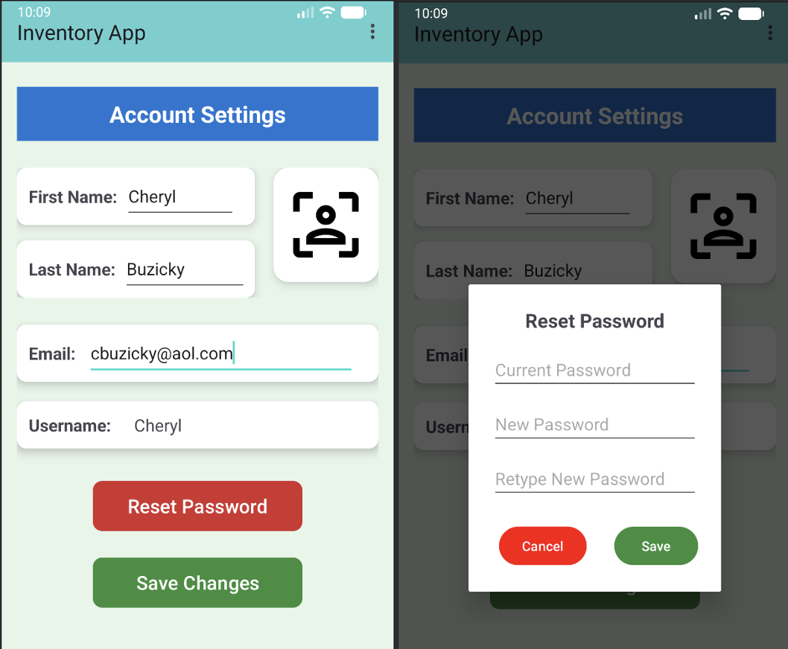
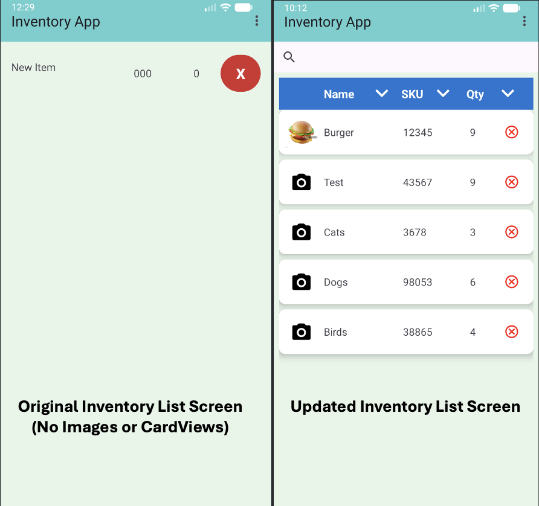
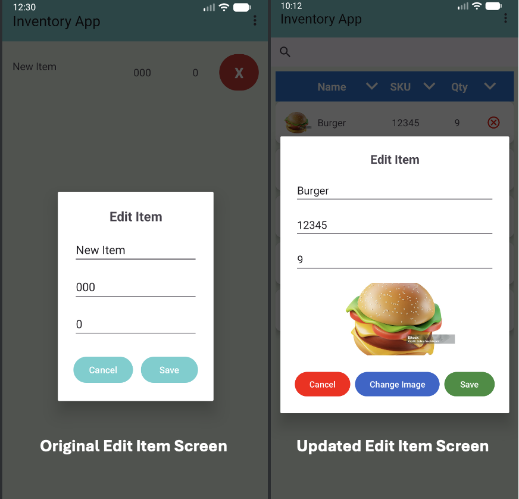

# CS499 - SNHU Capstone Project

<h3>
    Code Review:
    <a href="https://youtu.be/ms-hm71Fm98"
       target="_blank"
       rel="noopener noreferrer">
        YouTube Link
    </a>
</h3>
        

This video offers a comprehensive walkthrough of the original application and discusses planned enhancements, including improvements to security, 
code documentation, and overall application functionality.

<h3>Original Artifact:
    <a href="https://github.com/cbuzicky/CS-499-Capstone/tree/main/Original_Inventory_Application%20"
       target="_blank"
       rel="noopener noreferrer">
        Inventory Application
    </a>
</h3>

This artifact, the Inventory Application, was originally developed for CS 360 - Mobile Architecture and Programming and was used as the foundation for the enhancements across all three categories.

<h3>Enhancement One:
    <a href="https://github.com/cbuzicky/CS-499-Capstone/tree/main/Enhancement_1"
       target="_blank"
       rel="noopener noreferrer">
        Software Design and Engineering
    </a>
</h3>

The artifact I chose to modify for the Software Engineering and Design category is the Inventory Application. 
This project involved the creation of a mobile application as the final project for my CS 360 Mobile Architectures course, 
which I completed in February of this year. The application was developed in Android Studio using Java for the backend 
functionality and XML for the frontend user interface design. The original assignment required users to create a username 
and password, enter items into an inventory list, and configure SMS notifications when the quantity of an item falls below a specified threshold.

I chose this artifact to showcase my skills across all three categories in this course for several reasons. I particularly 
enjoyed working in Android Studio and developing both the frontend and backend components of the application. 
Because of this, I felt the project would effectively demonstrate my technical abilities while also highlighting the course outcomes. 
From a Software Engineering and Design perspective, the application contained several areas that needed improvement in order 
to become more functional, professional, and user-friendly.

One major limitation of the original application was the absence of an Account Settings page, which prevented users from saving 
or editing personal information or resetting their password. To address this issue, I designed and implemented a new Account 
Settings page that allows users to update their password and add personal information such as their name, email address, and profile photo. 
Selecting the “Reset Password” button opens a dialog box that allows users to securely change and save a new password. Additionally, I added
input validation for the first name, last name, and email fields to improve data accuracy and protect against invalid user input.

In addition to these changes, the Inventory List page originally lacked visual organization and overall polish. To improve the appearance 
and usability of the page, I redesigned the layout using CardView components within the Inventory Item XML file. I also added functionality 
that allows users to upload and display photos for individual inventory items. These design improvements demonstrate my ability to enhance the 
usability and accessibility of an application, allowing users to customize the application to better fit their individual needs and preferences.

The work completed on this project successfully met the course outcomes identified in Module One. Specifically,
the project demonstrated outcomes one and two: “Employ strategies for building collaborative environments that enable diverse
audiences to support organizational decision-making in the field of computer science,” and “Design, develop, and deliver 
professional-quality oral, written, and visual communications that are coherent, technically sound, and appropriately 
adapted to specific audiences and contexts.” At this time, I do not plan to make any changes to my strategy for addressing these or the remaining course outcomes.

The process of enhancing this artifact was both challenging and rewarding. Since it had been some time since I 
last worked in Android Studio, I first needed to refamiliarize myself with the development environment and how the different 
application components interact to run successfully. I also spent a significant amount of time developing the Account Settings 
enhancement. While creating the page layout itself was not overly difficult because it followed a structure similar to my 
notifications page, integrating the new database fields required additional planning and testing.
Throughout this process, I realized how much I enjoy working with XML to design application interfaces. 
It was rewarding to see how a few relatively simple design changes could make the application appear much cleaner, more organized, and more professional.

One of the most difficult challenges was displaying the currently logged-in username on the Account Settings page, 
since I needed to retrieve the stored value from the database and dynamically display it within the interface. 
I also learned that image handling in Android applications is commonly managed using URIs, which was a completely new concept for me. 
To implement this functionality, I spent time reviewing Android documentation and watching instructional YouTube videos 
to learn how to save, retrieve, and display images correctly within the application.

Although this process took longer than expected, it significantly expanded my understanding of Android development 
and data management. Overall, enhancing this artifact was an extremely valuable learning experience. It strengthened 
both my frontend and backend development skills while also improving my understanding of software design, usability, and database integration.
I am looking forward to continuing future enhancements to the Inventory Application in order to further improve its 
functionality and better align it with industry standards.

  

    <strong>Account Settings</strong> 
    
  

  

    <strong>Inventory List Changes</strong> 
    
  

  

    <strong>Edit Items Dialog Changes</strong> 
    
  

<h3>Enhancement Two:
    <a href="https://github.com/cbuzicky/CS-499-Capstone/tree/main/Enhancement_2"
       target="_blank"
       rel="noopener noreferrer">
        Algorithms and Data Structure
    </a>
</h3>

The artifact I chose to modify for the Algorithms and Data Structure category is the Inventory Application once again. This project involved the creation of a mobile application as the final project for my CS 360 Mobile Architectures course, which I completed in February of this year. The application was developed in Android Studio using Java for the backend functionality and XML for the frontend user interface design. The original assignment required users to create a username and password, enter items into an inventory list, and configure SMS notifications when the quantity of an item falls below a specified threshold.

I chose this artifact to showcase my skills across all three categories in this course for several reasons. I particularly enjoyed working in Android Studio and developing both the frontend and backend components of the application. In addition, creating the algorithms for the original application and identifying opportunities to improve and expand upon them made this project a great candidate for this category. To implement the planned enhancements, I modified several existing algorithms and developed new ones to support the search and sort functionality added to the Inventory List page.

The first changes that were made included the addition of a search bar at the top of the Inventory List page, which was implemented as a SearchView in the InventoryGrid XML layout. To support this functionality, modifications were made to both the InventoryGrid and InventoryAdapter classes. In the InventoryGrid class, I added a query text listener that was attached to the SearchView, so that the application could respond whenever the user entered text. As the user types, the search query is passed to the adapter, which updates the displayed inventory items in real time. This enhancement was important because it allows search results to update as the user types, rather than requiring the user to click the Search button before results are displayed, creating a more efficient and user-friendly experience.

Within the InventoryAdapter class, a new filtered list was created to store the search results separately from the complete inventory list. I added a filter() method to compare the user's search text against each item's name and SKU. If a match is found, the item is added to the filtered list and displayed in the RecyclerView. This algorithm provides incremental searching, allowing results to update dynamically with each character entered by the user. The addition of this functionality improved the usability of the application by enabling users to quickly locate inventory items without manually scrolling through the entire inventory list.

To implement the sorting functionality within the Inventory List screen, additional enhancements were made to the InventoryGrid class as well. Sort icons were added to the Name, SKU, and Quantity column headers, allowing users to organize inventory records in either ascending or descending order. This was accomplished by creating a reusable sorting method that applies a comparison-based sorting algorithm to the filtered inventory list. The sorting logic uses Java's collections.sort() method with lambda expressions to arrange items by name, SKU, or quantity in either ascending or descending order. These improvements increased the efficiency of the application by giving users greater control over how inventory data is displayed and organized.

The work completed on this project successfully met the course outcomes identified in Module One. Specifically, this category demonstrated outcomes three and four: "Design and evaluate computing solutions that solve a given problem using algorithmic principles and computer science practices and standards appropriate to its solution, while managing the trade-offs involved in design choices" and "Demonstrate an ability to use well-founded and innovative techniques, skills, and tools in computing practices for the purpose of implementing computer solutions that deliver value and accomplish industry-specific goals." At this time, I do not plan to make any changes to my strategy for addressing these or the remaining course outcomes, since the final category that will be completed next week in Milestone Four will implement the remaining course outcome.

Working on these enhancements helped me realize the importance of researching different implementation methods before integrating them into an application. When I first began working on the sorting functionality, I planned to create separate methods to sort by name, SKU, and quantity. However, after researching different approaches for sorting lists in Java, I decided to use Collections.sort() with comparator lambda expressions, which allows data to be sorted in both ascending and descending order (Singh, 2022). Another advantage of this approach is that it enabled me to create a single reusable method to handle sorting for all three fields instead of writing separate methods for each one. This required some trial and error to properly structure the lambda expressions, but once I had this working for the name field, I was able to apply the same logic to SKU and quantity with only changes to the view reference.

Another challenge I faced was learning how to connect the SearchView in the XML layout to the logic in the InventoryGrid class. I needed to attach a query text listener so the application could detect when the user entered or changed text in the search bar. Once connected, I passed the input text to the adapter, where it was used to filter the underlying list and update the displayed inventory items in real time. The most difficult part of this process was maintaining consistency between the original list and the filtered list within the adapter to support dynamic searching. This was addressed by storing the complete inventory in one list (items) and using a separate filtered list to represent the currently displayed results. During each search event, the filter() method clears and rebuilds the filtered list based on the original dataset, ensuring that results always match what is entered in the search bar. To keep the RecyclerView state synchronized with these changes, notifyDataSetChanged() was used to trigger a full UI refresh after each update. This process works well for datasets that are relatively small in size; however, if the list were to grow significantly, I may need to reevaluate this approach to develop a more efficient method of updating the dataset, which will help avoid potential performance issues in the future.

After testing all of these features, I was satisfied with how they functioned within the application. While there is always room for improvement during the software development process, I was excited to successfully implement both the search and sorting capabilities into the application. These enhancements not only improved the overall user experience but also provided valuable experience working with filtering algorithms, sorting algorithms, and dynamic user interface updates. The knowledge and techniques gained from implementing these features will support my future application development work, particularly in areas where similar functionality is required.

<h3>References</h3>

Singh, C. (2022, September 11). <em>Java 8 lambda comparator example for sorting list of custom objects</em>. BeginnersBook. https://beginnersbook.com/2017/10/java-8-lambda-comparator-example-for-sorting-list-of-custom-objects/

  

    <strong>Sort and Search Functionality</strong> 
    
  

<h3>Enhancement Three:
    <a href="https://github.com/cbuzicky/CS-499-Capstone/tree/main/Enhancement_3"
       target="_blank"
       rel="noopener noreferrer">
        Databases
    </a>
</h3>

<h3><a href="self-assessment.html">Professional Self-Assessment</a></h3>
